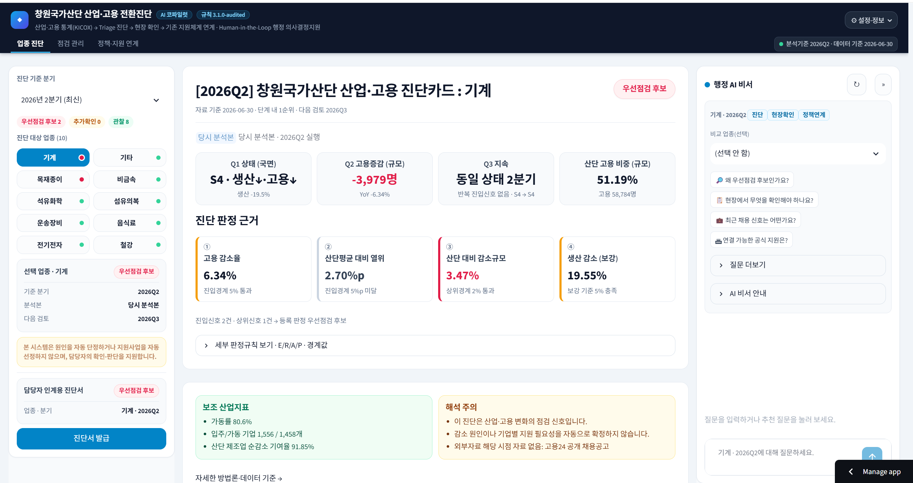
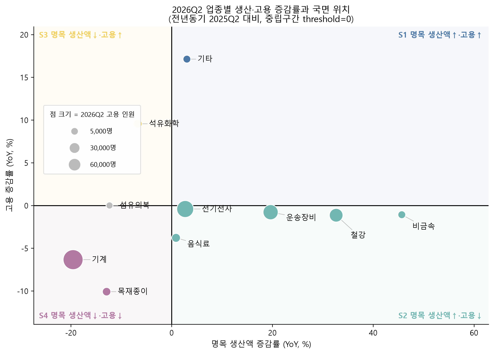
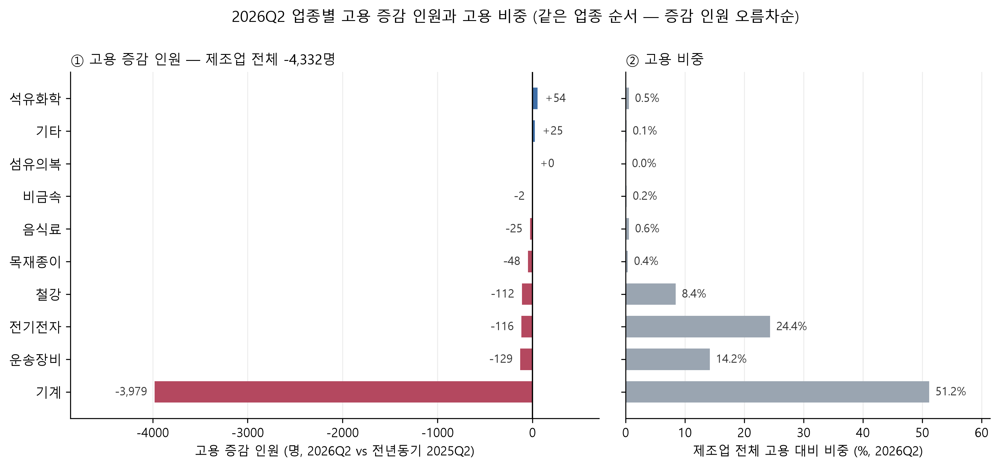
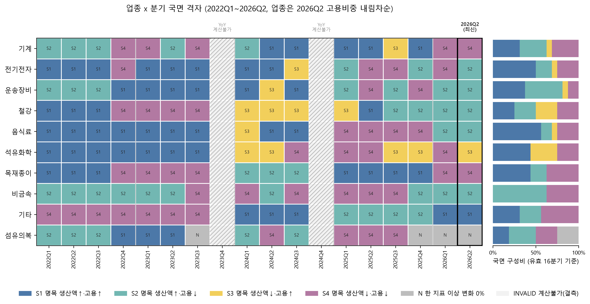
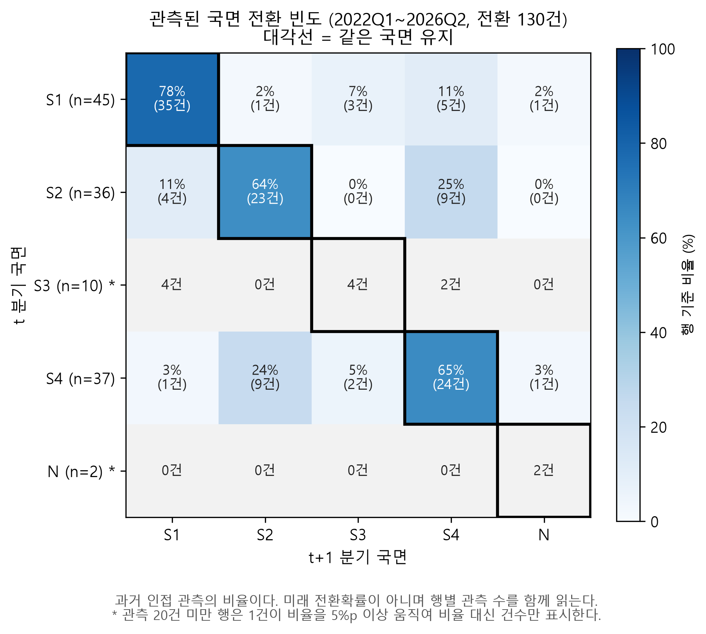
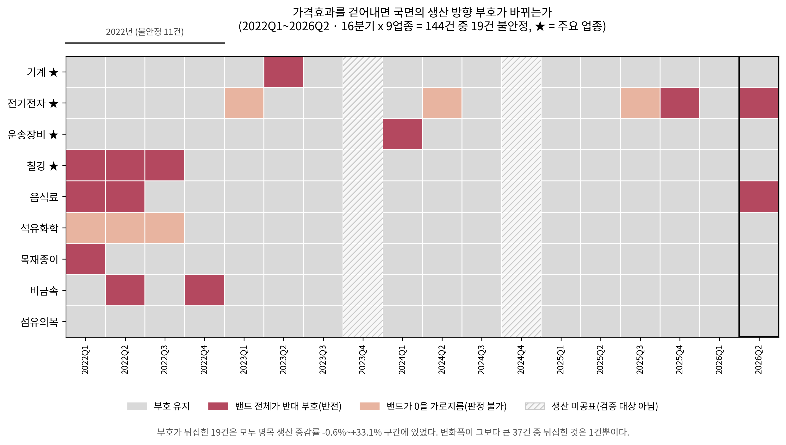
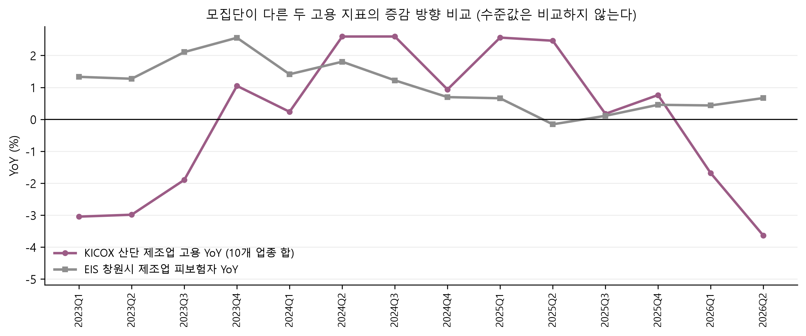

# 창원국가산단 업종별 산업·고용 진단 및 지원연계 시스템

창원국가산단의 **업종별 생산·고용 변화**를 읽고, 먼저 확인할 업종을 **현장 확인과 기존 기업·고용·훈련 지원체계**에 연결하는 데이터·AI 기반 의사결정지원 시스템이다.

`분석·시스템 구현 완료` · `최종 보고서·Tableau 제작 중` · `Python 3.11+`

<p align="center">
  
</p>
<p align="center"><sub>실제 Streamlit 화면 — 2026Q2 기계 업종 진단카드와 행정 AI 비서</sub></p>

## 1. 프로젝트 배경

창원에는 산업동향, 기업지원, 위기대응, 고용지원, 직업훈련, 채용지원 기능이 이미 있다. 문제는 기능의 부재가 아니라 **기관별 자료 단위와 업무 진입경로가 달라 산업·고용 신호를 현장 확인과 지원기능 검토까지 연결하기 어렵다**는 점이다.

이 시스템은 KICOX 생산·고용으로 업종별 점검 신호를 계산하고, 외부자료와 공개 채용정보로 확인 질문을 구체화한다. 담당자는 Streamlit에서 근거를 보고 점검·인계를 기록한다. 결과는 **업종 단위 점검 순서**이며 법정 위기 지정이나 개별 기업의 지원대상 확정이 아니다.

## 2. 시스템 활용 흐름

```text
① KICOX 생산·고용 정합성 확인
                ↓
② Q1 상태 · Q2 규모 · Q3 시간 분석
                ↓
③ Triage: 관찰 / 추가확인 / 우선점검
                ↓
④ 외부근거·고용24 공개 채용정보 확인
                ↓
⑤ 업종별 진단카드 → 담당자·기업·현장 확인
                ↓
⑥ 기존 기업·고용·훈련·위기대응 기능 검토·인계
                ↓
⑦ 다음 분기 재점검
```

③에서 **추가확인 사례만** ELECTRE TRI-B / SMAA-TRI로 선택적 재검토를 한다. AI/RAG는 ④~⑥에서 등록 진단 설명과 공식 문서 탐색을 돕는다. 외부근거와 AI는 CORE/Triage 판정을 바꾸지 않으며 **사람이 최종 판단**한다.

## 3. 분석 체계

| 단계 | 질문 | 결과가 하는 일 |
|---|---|---|
| **Q1 · 상태** | 같은 고용 변화라도 생산 방향은 다른가? | 생산·고용 YoY로 현재 국면(S1~S4)을 설명 |
| **Q2 · 규모** | 어느 업종의 고용 변화가 큰가? | 증감 인원·고용 비중·전체 변화 기여를 표시 |
| **Q3 · 시간** | 그 국면이 이어지는가, 바뀌는가? | 지속기간·Timeline·인접 분기 전환을 확인 |
| **Triage · 점검** | 이번 분기에 무엇을 먼저 확인할까? | 관찰·추가확인·우선점검 단계와 근거를 제시 |

CORE의 자동 판정 입력은 KICOX 생산·고용에서 계산한 지표다. 외부자료와 채용공고는 그 뒤에 검토한다. 변수와 경계값은 [부록 B](#부록-b-판정-규칙과-선택적-재검토)에 정리했다.

## 4. 주요 분석 결과

### Q1 · 생산·고용 방향의 차이

2026Q2 고용이 감소한 7개 업종 가운데 **5개는 명목 생산이 증가**했다. 고용 감소라는 하나의 신호만으로 산업활동의 국면을 설명하기 어렵다.

<p align="center">
  
</p>
<p align="center"><sub>Q1 — 생산·고용 YoY의 조합과 업종별 고용 규모</sub></p>

### Q2 · 업종별 고용 변화 규모

2026Q2 창원국가산단 제조업 고용은 전년동기보다 **4,332명 감소**했고, 그중 **기계 업종이 3,979명 감소**했다. 증감률만 보면 놓치는 업종별 규모 차이를 고용 인원과 비중으로 확인한다.

<p align="center">
  
</p>
<p align="center"><sub>Q2 — 업종별 고용 증감 인원과 산단 제조업 고용 비중</sub></p>

### Q3 · 국면 지속과 전환

같은 업종도 분기마다 국면이 유지되거나 전환된다. 아래 격자는 **10개 업종 × 18분기**의 상태를 보여준다. 빗금은 YoY 계산이 불가능한 구간이며, 상태 전환은 과거 관측 빈도이지 미래 예측확률이 아니다.

<p align="center">
  
</p>
<p align="center"><sub>Q3 — 업종별 State Timeline과 국면 구성</sub></p>

<p align="center">
  
</p>
<p align="center"><sub>Q3 — 인접 분기 국면 전환행렬. 표본이 작은 행은 비율 해석을 제한한다.</sub></p>

### 최종 Triage · 업종별 점검 단계

| 범위 | 관찰 | 추가확인 | 우선점검 |
|---|---:|---:|---:|
| 전체 180개 업종·분기 | 128 | 35 | 17 |
| 최신 2026Q2, 10개 업종 | 8 | 0 | 2 |

2026Q2 우선점검 업종은 **기계·목재종이**다. 이는 담당자가 먼저 확인할 업종이지 기업별 위기 판정이 아니다. [전체 Triage 결과](outputs/final_model/02_triage/tables/triage_panel.csv)와 [추가확인 35행의 선택적 재검토](outputs/final_model/03_electre_smaa/tables/electre_smaa_review_cases.csv)를 별도로 제공한다.

## 5. 판정 이후 근거 확인과 지원 연계

### 외부근거

PPI는 명목 생산 방향에 가격효과가 섞였는지, EIS는 모집단이 다른 고용지표와 방향이 일치하는지 **제한적으로 교차확인**한다. 수출입, 전력, 가동률·업체 수, 경기심리·고용흐름은 범위와 매핑 품질을 표시한 맥락 자료다. 서로 다른 정의의 수치를 직접 합산하거나 CORE 단계를 바꾸지 않는다.

<p align="center">
  
</p>
<p align="center"><sub>PPI — 일부 관측의 생산 증감 방향은 가격 보정 가정에 민감하다.</sub></p>

<p align="center">
  
</p>
<p align="center"><sub>EIS — 모집단이 다른 두 고용지표는 수준값을 비교하지 않고 변화 방향만 본다.</sub></p>

### 채용공고·정책·AI

- **Recruitment Evidence:** 고용24 공개공고의 기업·직무·경력·지역 정보를 기업·공장등록·업종과 품질을 표시하며 연결한다. 우선점검 업종에서 **어떤 기업에 무엇을 물을지** 구체화한다. 공고 수는 업종 전체 노동수요나 미충원 규모가 아니다.
- **정책·기관 Routing:** 공식 사업의 대상·요건·담당기관·문의 경로와 기존 기업지원·고용지원·훈련·위기대응 기능을 탐색한다. 담당자가 현장 확인 후 실제 적합성과 접수 상태를 판단하고 인계를 기록한다. `공모전 팀 제안`은 현재 시행 중인 공식 사업과 구분한다.
- **행정 AI 비서:** 등록 진단을 설명하고 공식 정책문서를 RAG로 검색하며 근거 유형·출처를 보여준다. Gemini 키가 있으면 근거 기반 문장을 작성·요약하지만 숫자·판정·인용 검사를 통과해야 한다. 실패하거나 키가 없으면 등록 진단·검색 결과로 대체한다. AI는 분석을 재계산하거나 정책을 자동 결정하지 않는다.

## 6. 구현 화면과 주요 산출물

| 화면 | 담당자가 할 수 있는 일 |
|---|---|
| **업종 진단** | 분기·업종 선택, Q1~Q3·Triage 근거, 외부·채용 신호, 확인 질문, 진단 요약 HTML·JSON 저장 |
| **점검 관리** | 점검건 개설, 기업·현장 확인, 지원 필요 기능·결정·인계·다음 검토 분기 기록 |
| **정책·지원 연계** | 공식 사업 카드·기관·근거 검색·기업마당 공고 확인, 별도 팀 제안 열람 |
| **설정·정보 / AI 비서** | 분석 버전·데이터 기준·연결 상태 확인, 등록 진단·공식 문서 질의응답 |

화면은 등록 분석본(`snapshots/`)을 읽고 점검 기록을 로컬 DB에 저장한다. 화면에서 Q1~Q3나 Triage를 다시 계산하지 않는다. 주요 산출물은 [최종 방법론](reports/final_methodology.md), [최종 결과 요약](reports/final_result_summary.md), [업종별 진단카드](outputs/final_model/05_handoff/tables/industry_diagnostic_cards_2026Q2.csv), [최종 결과 HTML](outputs/final_model/06_report_assets/final_results.html)에서 확인할 수 있다.

## 7. 해석 범위와 프로젝트 상태

- 업종 단위 결과는 개별 기업 상태나 원인을 직접 뜻하지 않는다. 생산·고용의 동반변화는 인과관계의 증거가 아니다.
- 공공자료에는 공표·개정 시차가 있고, 명목 생산액의 가격·물량 분리와 외부자료의 지역·업종 매핑에 한계가 있다.
- 고용24 공개공고는 전체 노동수요를 대표하지 않는다. 정책사업·접수 상태는 바뀔 수 있고 AI 답변은 담당자 판단을 대체하지 않는다.

**Q1~Q3, Triage, 외부·채용 근거, 정책·기관 연계, AI/RAG 및 Streamlit 구현은 완료됐다.** 남은 주요 산출물은 **최종 분석보고서**, **Tableau 최종 시각화·대시보드**, **최종 발표자료**와 필요 시 시연 준비다. 팀명은 **창원해요**, 참가 대상은 **2026년 창원시 AI·데이터 활용 공모전**이다.

---

## 부록 A. 데이터 범위와 역할

| 데이터 | 출처·기간 | 단위와 사용 역할 |
|---|---|---|
| 생산·고용 및 연간보정본 | KICOX, 2018Q1~2026Q2 | 창원국가산단 업종×분기. **CORE** 자동 판정 입력 |
| 가동률·업체 수 | KICOX, 최종 분석 기간 | 단지·업종×분기. 산업활동 확인질문 |
| 생산자물가지수 | KOSIS, 2021.01~2026.06 | 품목·월→업종 후보·분기. 명목 생산 방향 민감도 |
| 고용보험 EIS | 고용행정통계, 2022Q1~2026Q2 | 지역·산업×분기. 정의 차이를 표시한 방향 비교 |
| 수출입·전력·경기심리·고용흐름 | 관세청·KEPCO·한국은행·고용부, 자료별 기간 상이 | 시·HS6, 법정동×KSIC, 경남·전국 등. **CONTEXT** |
| 공개 채용공고 | 고용24, 2026년 9월 수집 단면·현행 상세 표본 | 공고·기업. 현장 확인 보조 |
| 공식 제도·기관 문서 | 기관 공식 자료·기업마당 조회 | 문서·사업·기관. 정책/RAG 근거 |

원자료는 2018Q1부터 보유하고, YoY 계산이 가능한 최종 분석 패널은 **2022Q1~2026Q2, 10개 업종 × 18분기 = 180행**이다. KEPCO 법정동 18개는 산단 공식 경계가 아니며 업종 합계도 불완전하다. 세부 품질과 승격·제외 기준은 [데이터 역할표](outputs/final_model/04_external_evidence/data_role_table.csv)를 참고한다.

## 부록 B. 판정 규칙과 선택적 재검토

- **Q1:** 생산·고용 YoY 부호로 S1 동반확대, S2 생산확대·고용감소, S3 생산감소·고용증가, S4 동반감소를 구분한다. 정확히 0인 축은 `N`, 결측·비교불가는 `INVALID`다. S번호는 위험 순위가 아니다.
- **Q2:** 고용 증감 인원, 고용 비중, 산단 전체 변화 기여를 계산한다. 전체 순변화가 작으면 기여율 해석을 제한한다.
- **Q3:** 동일 상태 연속분기와 인접 분기 전환을 계산한다. 결측을 건너 연결하지 않고 관측 경계 절단을 표시한다.
- **Triage:** 고용감소율 `E`, 산단 제조업 평균 대비 열위 `R`, 감소인원의 산단 제조업 고용 대비 비율 `A`를 사용한다. 진입경계는 **5%·5%p·1%**, 상위경계는 **10%·10%p·2%**다. 상위경계에 생산감소 `P≥5%` 또는 직전 분기 반복신호가 더해지면 우선점검 후보가 되고, 우선점검에는 **고용 300인 이상** 규모 게이트가 적용된다. 핵심 고용정보가 없으면 자료확인으로 분리한다.
- **ELECTRE TRI-B / SMAA-TRI:** Triage 추가확인 35행만 선택적으로 재검토한다. 결과는 모형 불일치·파라미터 민감성을 표시할 뿐 원 Triage 단계를 바꾸지 않으며 위기확률도 아니다.

경계값은 법정 위기 지정 기준이 아닌 프로젝트의 점검 운영규칙이다. [규칙 코드](src/triage/triage_rule.py), [최종 방법론](reports/final_methodology.md), [과거 실험 기록](logs/README.md)에 채택·제외 과정을 기록했다.

## 부록 C. 저장소와 결과 파일

```text
data/                 출처별 원자료·가공자료
src/core/             Q1~Q3
src/triage/           점검 단계
src/electre/          추가확인 사례 재검토
src/evidence/         외부·채용 근거
src/handoff/          진단카드·인계
src/app/              Streamlit 화면
src/workflow/         점검 기록
src/policy/           공식 정책 근거
src/copilot/          행정 AI 비서
notebooks/            단계별 분석 기록
outputs/final_model/  최종 분석 결과
snapshots/            앱에 등록된 분석본
reports/              최종 방법론·결과·QA
logs/                 과거 실험·검증 기록
```

| 결과 | 파일 |
|---|---|
| CORE 패널 | [`core_panel.csv`](outputs/final_model/01_core/tables/core_panel.csv) |
| Triage 패널 | [`triage_panel.csv`](outputs/final_model/02_triage/tables/triage_panel.csv) |
| 선택적 재검토 | [`electre_smaa_review_cases.csv`](outputs/final_model/03_electre_smaa/tables/electre_smaa_review_cases.csv) |
| 외부근거 | [`external_evidence_summary.csv`](outputs/final_model/04_external_evidence/external_evidence_summary.csv) |
| 진단카드 | [`industry_diagnostic_cards_2026Q2.csv`](outputs/final_model/05_handoff/tables/industry_diagnostic_cards_2026Q2.csv) |
| 최종 보고용 HTML | [`final_results.html`](outputs/final_model/06_report_assets/final_results.html) |

노트북은 [데이터 준비](notebooks/00_data_preparation.ipynb) → [EDA](notebooks/01_eda.ipynb) → [Q1~Q3](notebooks/02_q1_q2_q3_integrated_analysis.ipynb) → [Triage](notebooks/03_triage.ipynb) → [모형 실험](notebooks/04_model_evolution_and_experiments.ipynb) → [외부근거](notebooks/05_external_evidence.ipynb) → [최종 결과](notebooks/06_final_results.ipynb) 순서다. [RUNBOOK](outputs/final_model/RUNBOOK.md)에 실행 순서가 있다.

## 부록 D. 실행과 저장된 검증

저장소 루트에서 Python 3.11 이상을 사용한다.

```powershell
python -m venv .venv
.venv\Scripts\Activate.ps1
pip install -r requirements.txt
streamlit run src/app/main.py
```

브라우저에서 `http://localhost:8501`을 연다. API 키 없이 등록 진단과 공식 문서 기반 기능을 사용할 수 있다. Gemini 문장 작성과 기업마당 최신 공고가 필요하면 [`.env.example`](.env.example)을 `.env.txt` 또는 `.env`로 복사해 `GEMINI_API_KEY`, `BIZINFO_API_KEY`를 설정한다. 키와 로컬 업무기록 DB는 Git에 올리지 않는다. 분석 파이프라인 재실행 명령은 `python src/pipeline/run_final_pipeline.py`이다.

[최종 QA 요약](reports/final_qa_summary.md)은 2026-09-19 기준 활성 테스트 **63 passed**, CORE 180행, 선택적 재검토 35행, 최종 노트북 6/6 실행 통과와 핵심 CSV 해시 일치를 기록한다. 이는 규칙·재현성과 근거 경로의 검증이며 현장 효과나 예측 정확도 검증은 아니다.
