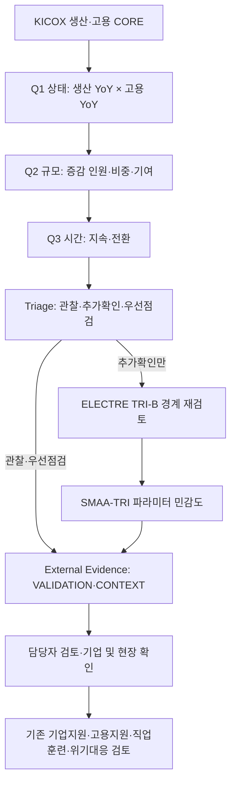

# 창원국가산단 산업·고용 전환진단 및 지원연계 최종 방법론

## 최종 채택 구조

자동 판정은 KICOX 생산·고용과 여기서 계산한 Q1~Q3만 사용한다. 가동률, 업체 수, PPI, EIS, 수출입, 전력, 노동이동, BSI, 채용공고는 판정 이후의 확인근거다. 외부자료가 CORE와 다르면 기간, 공간범위, 모집단, 업종 매핑을 먼저 확인한다.

## Q1~Q3와 Triage

- Q1은 생산 YoY와 고용 YoY의 상태를 표시하고 확인질문을 연결한다.
- Q2는 고용 증감 인원, 고용 비중, 산단 전체 변화 기여도를 표시한다.
- Q3는 상태 지속기간, 이전 상태와의 전환, 직전 분기의 진입신호 반복을 표시한다.
- Triage는 명시적 E/R/A 진입·상위경계, 300인 규모 게이트, 반복신호와 생산감소 보강으로 관찰·추가확인·우선점검을 정한다. 결과는 지원대상 선정이 아니라 점검 순서다.

## ELECTRE 선택적 채택

전체 180행에 ELECTRE를 다시 적용하는 구조는 채택하지 않는다. 주 140행 비교에서 Hybrid의 CHECK+ 집합은 ELECTRE와 같고 PRIORITY는 Triage와 같아 전체 직렬 구조가 새 정보를 더하지 않았기 때문이다.

대신 C안인 `Q1~Q3 → Triage → 추가확인 사례만 ELECTRE TRI-B → SMAA-TRI → External Evidence → Human Review`를 채택한다. 대상은 Triage 추가확인 35행뿐이다. 동일한 보존 실행의 `D_small_indifference` 고정배정과 compatible CAI를 사용하며, 결과는 OBSERVE 2, CHECK 9, PRIORITY 20, UNDETERMINED 4행이다. ELECTRE OBSERVE도 원 Triage를 관찰로 자동 하향하지 않고, PRIORITY도 우선점검으로 자동 승격하지 않는다. 이는 검토 순서와 모형 불일치를 표시하는 보조층이다.

SMAA-TRI의 CAI는 호환 파라미터 표집에서의 범주 배정 비중으로만 읽는다. 위기확률·정답률이 아니며, `possible_stages`가 둘 이상이면 파라미터 민감 사례로 표시한다. 외부자료는 결측과 범위 차이가 커 ELECTRE 가중치·profile·veto에 넣지 않고 다음 evidence 단계에서 확인한다.

담당자 검토 큐는 점수를 새로 만들지 않고 범주로만 나눈다. `UNDETERMINED` 4건은 자료·모형 불확실 확인, Triage와 ELECTRE가 충돌한 OBSERVE 2건은 모형 불일치 확인, PRIORITY는 SMAA 민감 여부에 따라 민감/안정 우선검토 후보로 구분한다. CHECK는 추가확인으로 유지한다. 이 순서는 검토 편의를 위한 것이며 지원대상 순위가 아니다.

## 외부데이터 원칙

최종 역할과 승격조건은 `outputs/final_model/04_external_evidence/data_role_table.csv`에 기록한다. PPI와 EIS/창원상의 고용보험은 제한적 VALIDATION, 수출입·전력·업체·가동률·노동이동·BSI·채용은 CONTEXT다. 단위 정의가 충돌하는 KEPCO 고객증감과 공개 패널이 없는 후보는 EXCLUDE다.

KEPCO 법정동×KSIC는 2022-04~2026-03의 48개월을 보유하지만 제조업 집적 법정동 18개는 산단 공식 경계가 아니다. 비식별률 40.47%, 업종 합계 COMPLETE 분기 0개, 2026Q2 미확보이므로 CONTEXT로만 둔다. 비식별값은 0·평균·보간·다른 법정동으로 대체하지 않고 공개 셀 합계를 업종 전체 전력으로 해석하지 않는다.

채용정보 1,504건은 2026-07-20~09-18의 공개공고 스냅샷이다. 업종코드, 모집인원, 과거 분모가 없어 공고 수를 고용 증가나 업종별 구인수요로 해석하지 않는다. 담당자가 최신 공고와 직무를 직접 확인하는 CONTEXT 자료로만 보존한다.

## Human Review와 지원연계

담당자는 생산 증가의 가격효과, 일회성 수주, 특정 대기업 영향, 자동화·설비투자, 실제 채용수요, 직무 미스매치, 업체 수와 가동상태 변화를 확인한다. 진단카드의 `first_owner`와 `handoff_review_functions`는 기업지원·고용지원·직업훈련·산업동향 중 검토할 기능을 제안한다. 특정 사업, 예산, 수혜기업을 자동 선정하지 않는다.

## 상태와 한계

최종 상태는 `READY_FOR_REPORT`다. 180행 Triage는 관찰 128, 추가확인 35, 우선점검 17이며 2026Q2 우선점검은 기계와 목재종이다. 외부자료의 결측·범위 차이는 역할 분리와 업종별 품질열로 통제했고, 선택적 ELECTRE가 원 Triage를 바꾸지 않도록 실행규약과 해시를 동결했다. 임계값의 정책 타당성과 현장 업무효율은 보고서 이후 실제 운영자료로 평가한다.
